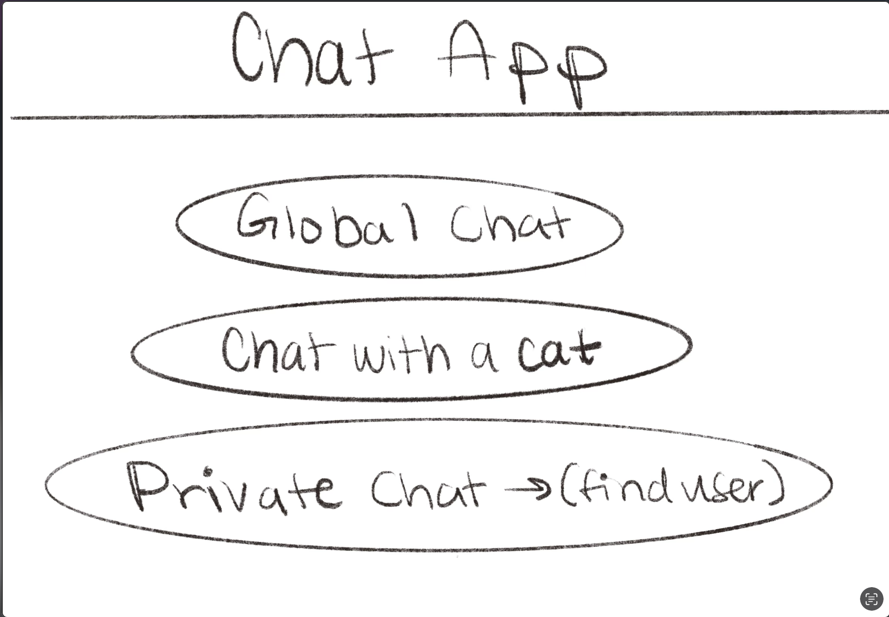
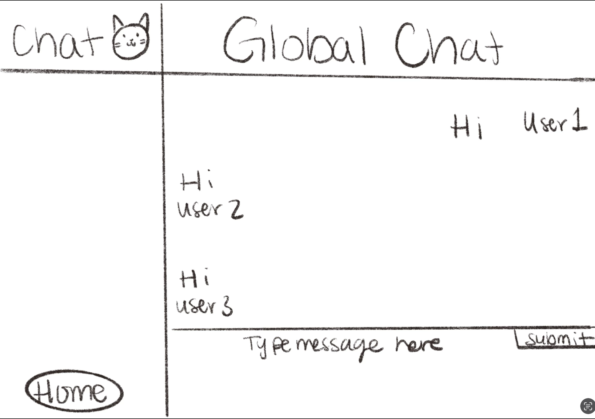
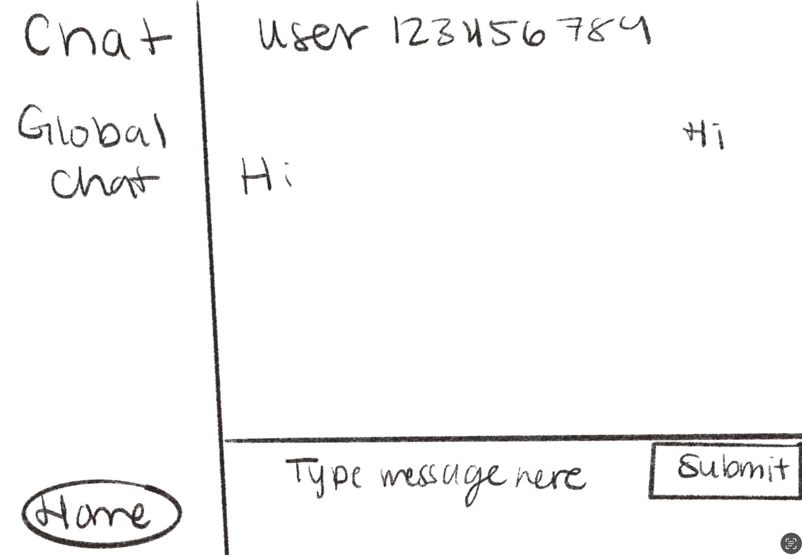
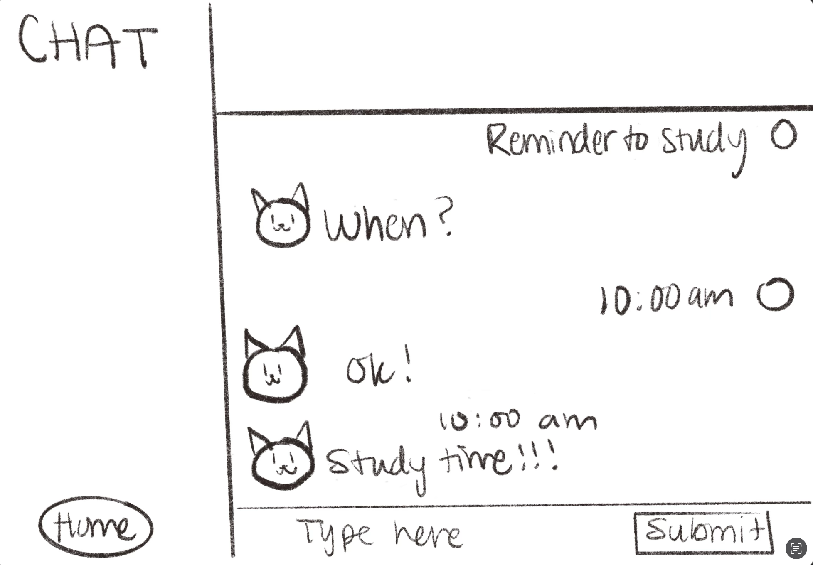

# CHAT 

## Overview


CHAT will be a real time chat web application that allows users to join chat rooms private or public (i.e all NYU or all Seniors (maybe just private ones though)) and have conversations with their friends / classmates/ colleagues. (WIP) It will use authentication to offer a secure and user friendly platform for communication online. (DONE) Additionally if time allows users will be able to send messages to a user named CAT who will reply (as a cat does) with meow WIP


## Data Model

The application will store Users, Chat Rooms and Messages(texts,images maybe)

* users can join multiple chat rooms
* each chat room can contain either 1 user or multiple
* chat with a cat room


An Example User:

```javascript
{
  username: "AITfan123",
  password: // a password hash or other form of auth,
  chatRooms: //references to chat room documents
}
```

An example chatroom:

```javascript
{
  user: // a reference to a User object
  name: 'GLOBAL',
  Messages: //array of references to message ,
  createdAt: // timestamp
}
```
An example message:

```javascript
{
  user: 'aitfan',
  chatRoom: //name of chatroom (if private made up of both users ids)
  Content: 'did u study??',
  createdAt: // timestamp
}
```


## [Link to Commented First Draft Schema](db.mjs) 


## Wireframes

/home - page for showing home screen 



/chatroom - page for selected chatroom (public)



/private - page for private chat



/lechat page for talking with cat

/authentication page


## Site map

[here](documentation/sitemap.png)

## User Stories or Use Cases


1. as non-registered user, I can register a new account with the site
2. as a user, I can log in to the site
3. as a user, I can join and participate in chat rooms
4. as a user, I can send messages in public chat rooms
5. as a user, I can send private messages to other users
7. as a user, I can send messages to a special cat themed chat

## Research Topics


* (4 points) Integrate user authentication
    * I'm going to be using passport for user authentication

* (6 points) socketio
    * Had to do a lot of research for socketio implementation


## [Link to Initial Main Project File](app.mjs) 


## Annotations / References Used

(__TODO__: list any tutorials/references/etc. that you've based your code off of)

1. [passport.js authentication docs](http://passportjs.org/docs) 
2. [react.js docs] https://react.dev/learn
3. https://stackoverflow.com/questions/18001478/referencing-another-schema-in-mongoose
4. https://vercel.com/docs
5. https://www.section.io/engineering-education/how-to-setup-nodejs-express-for-react/
6. https://socket.io/docs/v4/server-api/
7. https://mherman.org/blog/user-authentication-with-passport-dot-js/#mongoose
8. https://www.youtube.com/watch?v=-RCnNyD0L-s
9. https://www.npmjs.com/package/passport-local-mongoose
10. https://www.passportjs.org/packages/passport-local/
11. https://socket.io/docs/v3/rooms/
12. https://www.freecodecamp.org/news/build-a-realtime-chat-app-with-react-express-socketio-and-harperdb/#how-to-allow-users-to-send-messages-to-each-other-with-socket-io
13. https://developer.mozilla.org/en-US/docs/Web/JavaScript/Reference/Global_Objects/Array/find
14. https://stackoverflow.com/questions/19150220/creating-rooms-in-socket-io
15. https://mongoosejs.com/docs/api/model.html#Model.find()
16. https://mongoosejs.com/docs/documents.html#updating-using-save


